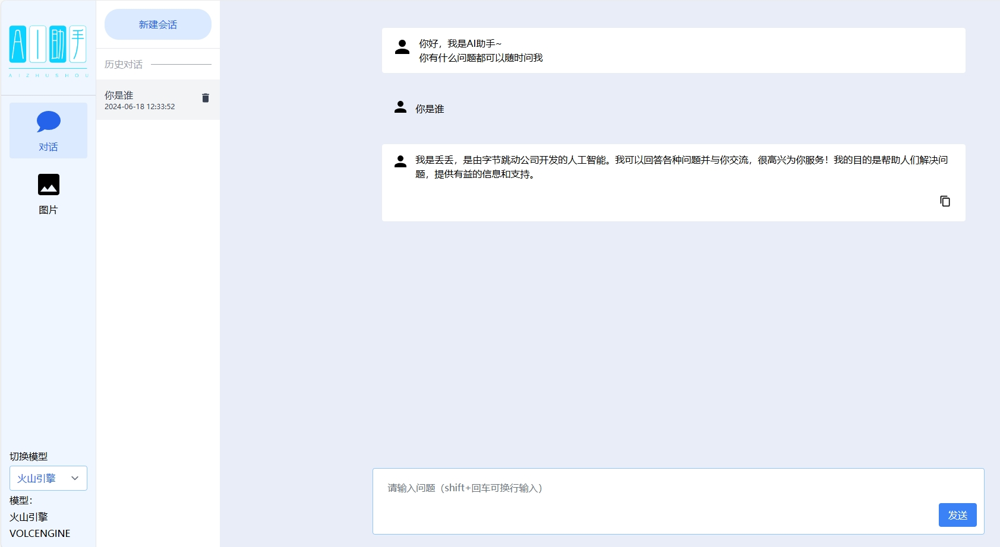
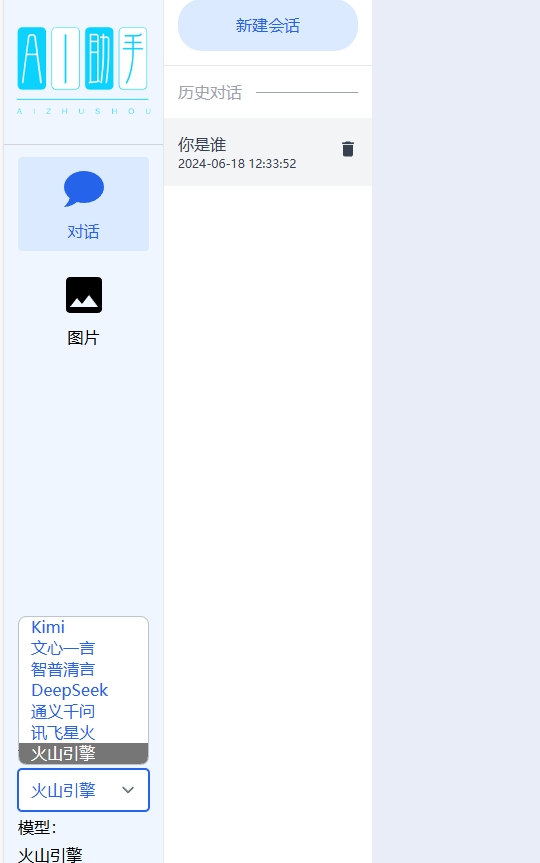
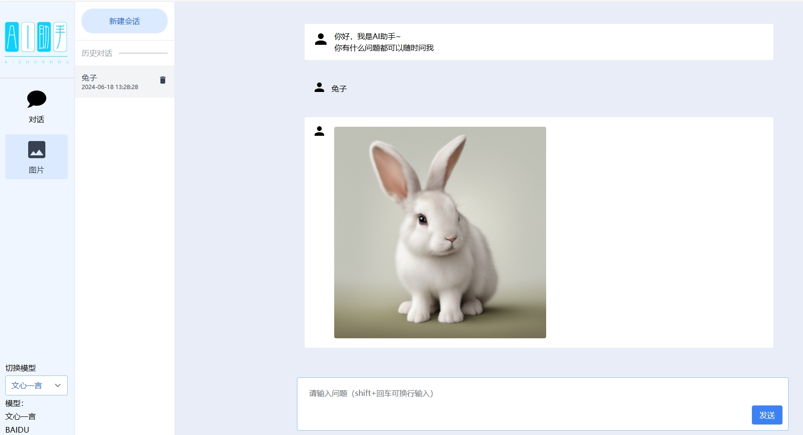
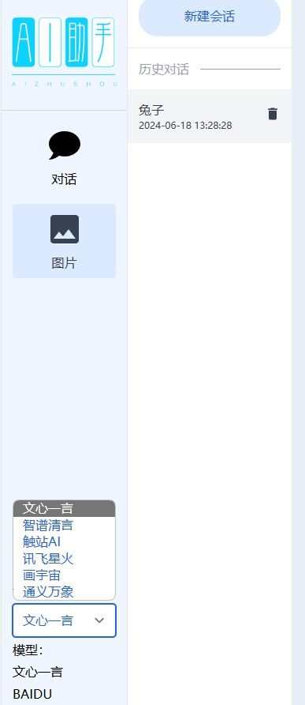

# ai-chat 后端

## 简介
ai-chat是一个开源的聊天系统后端，支持多种AI模型，旨在提供智能化的聊天服务。它不仅支持文本聊天，还支持图片处理，为用户提供丰富的交互体验。提供多种模型文心一言、KIMI、智谱清言、DeepSeek、OPENAI、通义千问、星火、腾讯混元助手（待接入）、火山引擎（豆包）、百度SD、通义万象、触站AI、画宇宙等。

## gitee地址
- 后台服务：[https://gitee.com/jsdhxkj/ai-chat.git](https://gitee.com/jsdhxkj/ai-chat.git)
- 管理端页面：[https://gitee.com/jsdhxkj/ai-chat-webadmin.git](https://gitee.com/jsdhxkj/ai-chat-webadmin.git)
- 客户端页面：[https://gitee.com/jsdhxkj/ai-chat-web.git](https://gitee.com/jsdhxkj/ai-chat-web.git)

## github地址
- 后台服务：[https://github.com/jsdjiazhiheng/ai-chat.git](https://github.com/jsdjiazhiheng/ai-chat.git)
- 管理端页面：[https://github.com/jsdjiazhiheng/ai-chat-webadmin.git](https://github.com/jsdjiazhiheng/ai-chat-webadmin.git)
- 客户端页面：[https://github.com/jsdjiazhiheng/ai-chat-web.git](https://github.com/jsdjiazhiheng/ai-chat-web.git)

### [使用说明](./use.md)

## 界面截图

## 功能特点
- **多模型支持**: 支持多种AI文字和图片模型，方便扩展和定制。
- **消息处理**: 支持文本、图片等多种格式的消息。
- **实时通信**: 实现了实时消息传递功能。
- **数据存储**: 消息持久化存储，保障数据安全。
- **安全性**: 提供了基本的认证和授权机制。

## 支持的AI模型
### 文字模型
* [X] **文心一言**
* [X] **KIMI**
* [X] **智谱**
* [X] **DeepSeek**
* [X] **OPENAI**
* [X] **通义千问**
* [X] **星火**
* [ ] **腾讯混元助手**
* [X] **火山引擎（豆包）**

### 图片模型
* [X] **百度SD**
* [X] **智谱**
* [X] **OPENAI**
* [X] **通义万象**
* [X] **触站AI**
* [X] **星火**
* [ ] **腾讯混元助手**
* [X] **画宇宙**
* [X] **火山引擎（豆包）**

### 图文模型
* [ ] **百度**
* [ ] **智谱**
* [ ] **OPENAI**
* [ ] **通义万象**
* [ ] **星火**
* [ ] **火山引擎（豆包）**

## 安装指南
1. 安装必要的依赖项。
2. 克隆项目到本地。
3. 配置数据库连接。
4. 根据需要配置AI模型接入。
5. 运行后端服务。

## 使用说明
- 如何启动服务。
- 如何发送和接收消息。
- 如何接入新的AI模型。

## 贡献
欢迎贡献代码，提交Pull Request或创建Issue，帮助我们完善AI模型支持和功能。

## 感谢
我们的基础框架是基于[RuoYi-Vue-Plus]的，我们对[RuoYi-Vue-Plus]的贡献者表示衷心的感谢。他们的工作为我们提供了一个坚实的起点，使得我们能够构建出更加强大的ai-chat后端。

## 联系方式
在使用的过程中，有任何问题和想法或者加入群聊请联系我

v: jiazhiheng2022